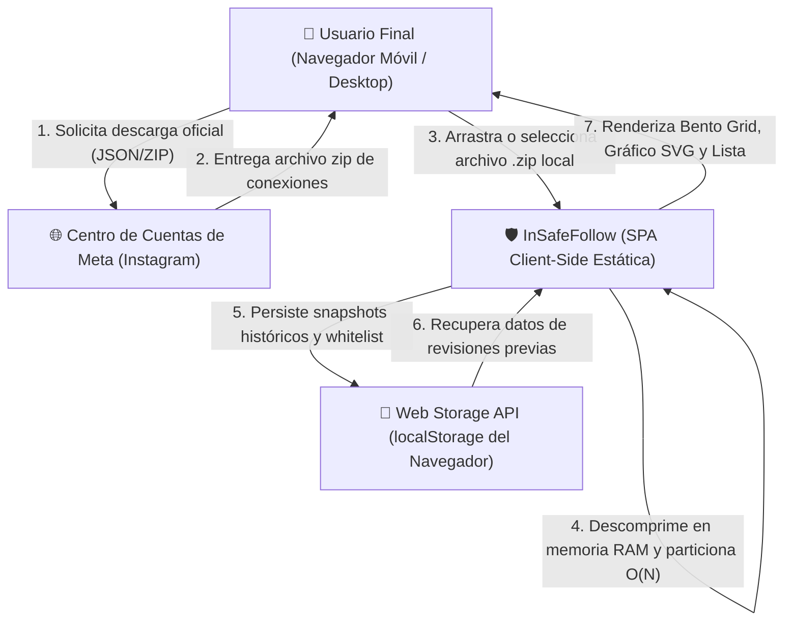
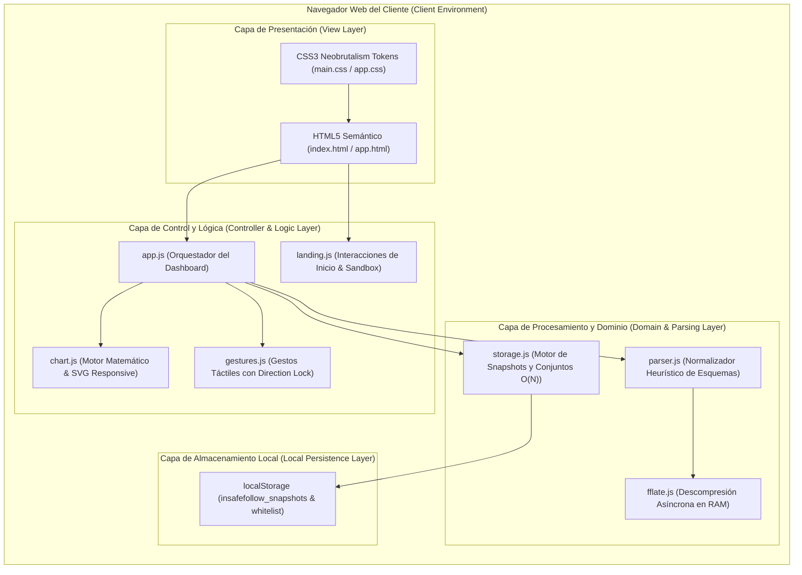
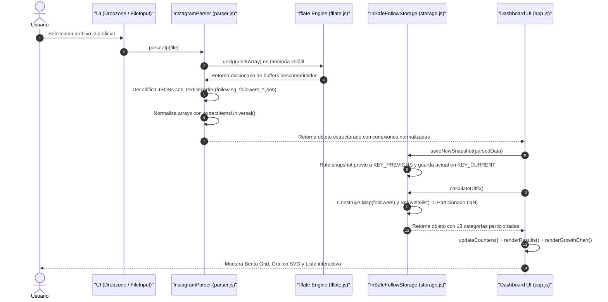
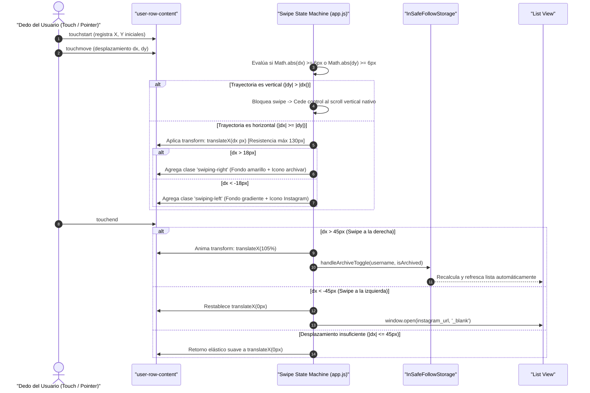

# 🏛️ Documento de Arquitectura de Software (SAD) y Sistema de Diseño Neobrutalista

**Proyecto:** InSafeFollow  
**Estándar de Documentación:** Modelo C4 (Context, Containers, Components, Code) & UML  
**Sistema de Diseño:** Neobrutalism UI System  

---

## 1. Visión General de la Arquitectura

**InSafeFollow** está estructurado como una **Single Page Application (SPA) Estática**, orientada a la privacidad (*Offline-First* y *Client-Side Execution*).

A diferencia de las arquitecturas cliente-servidor tradicionales donde la lógica de negocio y persistencia residen en una API REST o base de datos centralizada, InSafeFollow transfiere el 100% de la computación a la máquina virtual de JavaScript del navegador del usuario.

---

## 2. Modelo C4 (Architecture Metamodel)

### Nivel 1: Diagrama de Contexto del Sistema



### Nivel 2: Diagrama de Contenedores y Módulos



---

## 3. Diagramas de Secuencia del Ciclo de Datos

### 3.1 Pipeline de Ingesta, Descompresión y Particionado de Relaciones



### 3.2 Máquina de Estados de Gestos Táctiles (Swipe Gestures)



---

## 4. Patrones de Diseño de Software Implementados

1. **Adapter Pattern (`parser.js` - `extractItemsUniversal`):**
   Actúa como un adaptador estructural que abstrae los múltiples esquemas que Meta ha utilizado a lo largo de los años (`label_values`, `string_list_data`, `title`, arrays de objetos anidados), entregando una interfaz uniforme (`{ username, name, timestamp, href }`).

2. **Sentinel / Intersection Observer Pattern (`app.js`):**
   Utiliza un elemento centinela invisible al pie del viewport de la lista para desacoplar el renderizado del DOM del evento continuo de scroll, cargando en fragmentos de 30 elementos mediante un micro-task optimizado.

3. **Repository / State Pattern (`storage.js`):**
   Encapsula el acceso y mutación del almacenamiento local (`localStorage`), manteniendo la inmutabilidad de los datos en memoria y ofreciendo métodos atómicos (`addToWhitelist`, `calculateDiffs`, `clearAllData`).

---

## 5. Sistema de Diseño Neobrutalista (Neobrutalism Design System)

La interfaz de InSafeFollow adopta el movimiento estético contemporáneo del **Neobrutalismo Digital**, caracterizado por la honestidad visual, la alta legibilidad y la eliminación de ornamentos artificiales.

### 5.1 Tokens de Diseño (Design Tokens)

| Token CSS | Valor | Propósito y Semántica |
| :--- | :--- | :--- |
| `--bg-canvas` | `#fcf9f2` | Lienzo principal en tono crema cálido, reduciendo la fatiga visual. |
| `--border-base` | `2px solid #000000` | Bordes negros rígidos de alto contraste en tarjetas, botones y modales. |
| `--shadow-card` | `2px 2px 0px #000000` | Sombra geométrica pura sin desenfoque gaussiano (*hard offset*). |
| `--shadow-card-lg`| `4px 4px 0px #000000` | Sombra para modales y elementos de elevación prioritaria. |
| `--color-yellow` | `#fde047` | Color de acento primario (acción, atención, advertencia controlada). |
| `--color-danger` | `#ef4444` | Color semántico para cuentas que no siguen de vuelta o bloqueos. |
| `--color-success` | `#10b981` | Color semántico para nuevos seguidores, mutuos y mejores amigos. |
| `--font-display` | `'Space Grotesk', sans-serif` | Tipografía geométrica de alto carácter para cifras, badges y títulos. |
| `--font-sans` | `'Plus Jakarta Sans', sans-serif` | Tipografía humanista optimizada para legibilidad de nombres y párrafos. |

### 5.2 Micro-Interacciones Táctiles y Accesibilidad
* **Estados Activos / Hover:** Al interactuar con botones o tarjetas interactivas, los elementos ejecutan un desplazamiento inverso:
  ```css
  transform: translate(-1px, -1px);
  box-shadow: 3px 3px 0px #000000;
  ```
  Esto proporciona una respuesta táctil inmediata que simula el accionamiento de un pulsador físico analógico.
* **Accesibilidad (WCAG 2.1):** Todos los contrastes de color texto/fondo superan el ratio mínimo de **4.5:1** para texto normal y **3:1** para componentes de interfaz de usuario.
